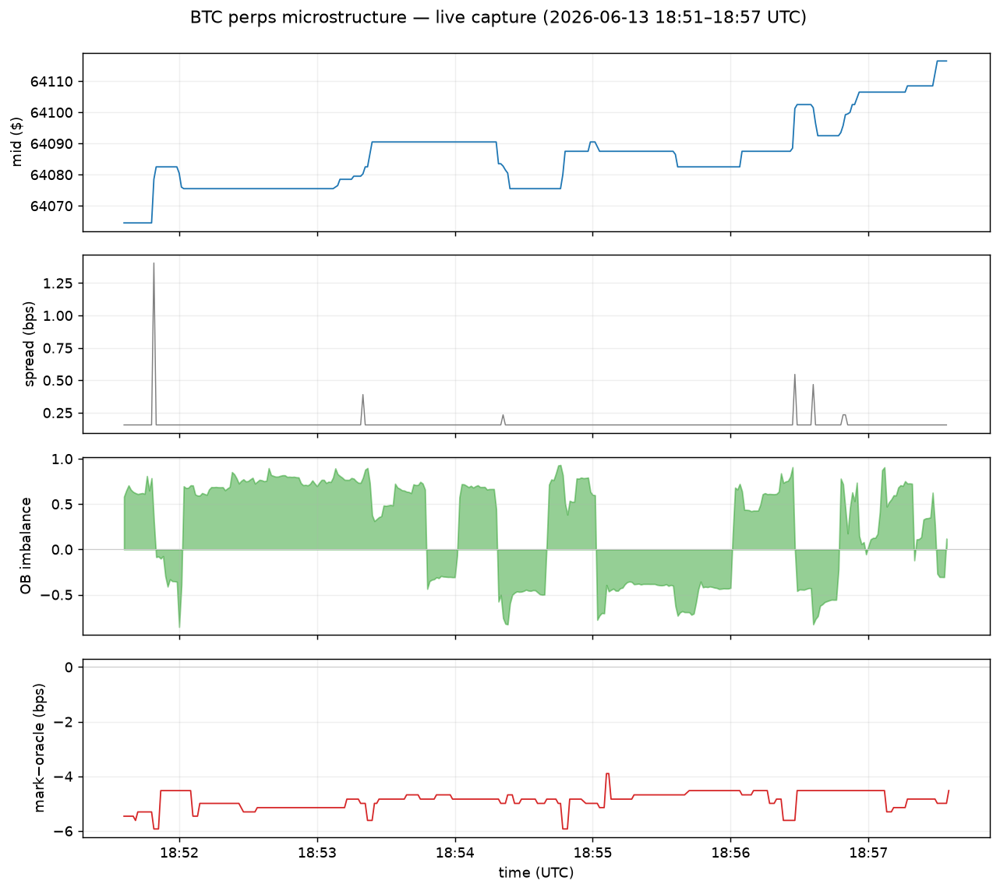

# hyperliquid-data-pipeline

[](https://github.com/Giri-Aayush/hyperliquid-data-pipeline/actions/workflows/tests.yml)


Collects market data from Hyperliquid — both live over WebSocket and historical from the S3 archive — turns it into OHLCV candles, indicators, and orderbook metrics, writes it to whichever store you point it at, and **backtests strategies against it**. I built it to feed my own trading research.

```
 WebSocket (live) ─┐
                   ├─▶  collect ──▶ process ──▶ validate ──▶  store ──▶  backtest
 S3 archive (past) ─┘                  │                  (Postgres · InfluxDB    (strategy →
                                       │                   · Redis · Parquet/R2)   Sharpe, PnL, DD)
                                       └── OHLCV · RSI/EMA/Bollinger · spread, depth, imbalance
```

## Try it in 30 seconds

No keys, no databases. Connects to the public WebSocket and prints live BTC data:

```bash
git clone https://github.com/Giri-Aayush/hyperliquid-data-pipeline.git
cd hyperliquid-data-pipeline
python3 -m venv .venv && .venv/bin/pip install -r requirements.txt
.venv/bin/python scripts/run_pipeline.py test-realtime --symbols BTC --duration 30
```

```
| INFO | Connecting to wss://api.hyperliquid.xyz/ws
| INFO | WebSocket connected successfully
| INFO | Sent 3 subscriptions
| INFO | Received orderbook for BTC
| INFO | Received trade for BTC
| INFO | Received ticker for BTC
```

## Examples

Three runnable scripts in [`examples/`](examples) that show the analytical output, not just the plumbing.

**Live orderbook microstructure** — spread, depth, and imbalance off each snapshot:

```bash
python examples/orderbook_metrics.py --symbol BTC --duration 30
```

```
time                mid  spread(bps)   imbalance       depth@5 bid/ask
----------------------------------------------------------------------
15:13:24    63,773.50         0.16      +0.670      23.80 / 1.88
15:13:25    63,773.50         0.16      +0.660      23.80 / 1.88
```

**Indicator engine** — RSI, EMAs, and Bollinger bands over a price series (deterministic, no network):

```bash
python examples/ohlcv_indicators.py
```

```
 bar       close     rsi      ema_10    bb_upper    bb_lower
------------------------------------------------------------
  30   48,325.73     4.4   48,699.66   50,189.33   48,101.03
  50   48,335.55    60.3   48,146.32   48,304.05   47,923.26
  60   48,517.08    70.2   48,383.43   48,582.64   47,864.89
```

**Backtest** — run a strategy over the collected OHLCV and report PnL, Sharpe, drawdown, win rate (deterministic, no network):

```bash
python examples/backtest_demo.py
```

```
=== SMA 10/30 ===
return           -35.53%
Sharpe             -0.50
max drawdown     -66.21%
win rate          28.33%
profit factor       1.02
trades                60
```

The engine has **no lookahead** (a signal from bar *i*'s close is acted on at *i+1*), charges fees and slippage on every position change, and supports long/short/flat. Point it at real data with `backtest.data.from_csv(...)` or `from_trades_parquet(...)` (the Parquet this pipeline writes). See [Backtesting](#backtesting).

## What the data shows

To show the pipeline captures real market activity, here is a six-minute live capture of BTC perps (2026-06-13, 18:51–18:57 UTC): 663 orderbook snapshots, 800 trades, and the per-second mark, oracle, and book metrics the pipeline computes. Regenerate it with `python examples/analyze_btc_capture.py`.



Three things stood out in this window. It's a short sample, not a study, but every number is real:

- **The perp traded at a steady discount to the index.** The mark price sat 3.9 to 5.9 bps below the oracle (index) price for the whole six minutes (mean -4.9 bps) and never crossed above it. A persistent negative mark-minus-oracle basis tends to move with funding pressure, and it's exactly what the `activeAssetCtx` feed and the computed basis exist to surface.
- **The book is tight and stable.** Median spread was 0.16 bps (about $1 on a ~$64,100 mid), and the 95th percentile was the same, so the quoted top of book barely moved for almost the whole window. The few brief widenings show up as the spikes in the spread panel.
- **Orderbook imbalance flips fast, and didn't cleanly lead price here.** It swung between strongly bid- and ask-heavy on a seconds timescale (mean +0.24, average magnitude 0.57) while the mid drifted up about 8 bps. Over six minutes I wouldn't read that as predictive; it's a reminder that a microstructure signal needs far more than a short window to judge.

The chart and a summary JSON come from [`examples/analyze_btc_capture.py`](examples/analyze_btc_capture.py), so you can point it at a longer window or another symbol and redraw it.

## What's in it

| Module | Does |
|---|---|
| `collectors/realtime_collector.py` | WebSocket feeds — l2Book, trades, mids, user events — with reconnect and bounded buffers |
| `collectors/historical_collector.py` | Pulls L2 snapshots and trades from the `hyperliquid-archive` S3 bucket (LZ4, requester-pays) |
| `processors/data_processor.py` | Trades → OHLCV with VWAP; SMA/EMA/RSI/Bollinger; orderbook spread (bps), depth, imbalance |
| `utils/validation.py` | Crossed books, bad sort order, price jumps, volume spikes, stale and duplicate points |
| `storage/database.py` | One interface, three DB backends: PostgreSQL (asyncpg), InfluxDB, Redis. Use any subset (each optional) |
| `storage/object_store.py` | S3-compatible object store (Cloudflare R2 / AWS S3 / Backblaze / MinIO): caches raw pulls, stores Parquet output |
| `scheduler/orchestrator.py` | APScheduler jobs for daily history pulls and quality reports; clean shutdown on signals |
| `backtest/` | Run a strategy over the collected OHLCV: no-lookahead engine, fees + slippage, long/short, and a metrics report (Sharpe, Sortino, drawdown, win rate, profit factor, expectancy) |

## Running the full thing

The demo above needs nothing. Beyond that there are two optional pieces.

**History from S3.** The archive bucket is requester-pays, so the transfer shows up on your AWS bill. Put `AWS_ACCESS_KEY_ID` / `AWS_SECRET_ACCESS_KEY` in `.env`, then:

```bash
.venv/bin/python scripts/run_pipeline.py collect-historical \
  --symbols BTC,ETH --start-date 2024-01-01 --end-date 2024-01-07
```

**Databases.** With nothing configured it writes JSONL and Parquet under `data/`. To use the servers:

```bash
docker run -d --name hl-postgres -e POSTGRES_DB=hyperliquid_data \
  -e POSTGRES_USER=hyperliquid -e POSTGRES_PASSWORD=change_me -p 5432:5432 postgres:15
docker run -d --name hl-influx -p 8086:8086 influxdb:2.7
docker run -d --name hl-redis  -p 6379:6379 redis:7
```

Copy `.env.example` to `.env`, fill in what you actually run, then:

```bash
.venv/bin/python scripts/run_pipeline.py start
```

Every database is optional — one that isn't configured (or isn't reachable) is skipped with a warning rather than crashing the pipeline.

**Storing to Cloudflare R2 (or any S3-compatible store).** Hyperliquid's archive is on AWS S3 and requester-pays — you can't move the *source*, so the first pull of a given object lands on your AWS bill. But you can point the pipeline at your own S3-compatible bucket to cache raw pulls and hold processed output. On R2 that means you pull each object from AWS **once**, then re-read it from R2 instead of paying AWS again — R2 charges no egress (you still pay R2's per-request and storage costs, which are small). Works with R2, AWS S3, Backblaze B2, or MinIO. This needs **its own credentials, separate from the AWS keys above** that read the source archive. In `.env`:

```bash
OBJECT_STORE_BACKEND=r2                    # r2 | s3 | local | none | auto
OBJECT_STORE_ENDPOINT_URL=https://<account_id>.r2.cloudflarestorage.com
OBJECT_STORE_BUCKET=hyperliquid-data
OBJECT_STORE_ACCESS_KEY_ID=<r2_access_key>
OBJECT_STORE_SECRET_ACCESS_KEY=<r2_secret_key>
OBJECT_STORE_REGION=auto
```

With that set, `collect-historical` caches raw LZ4 under `raw/…` (read-through: a re-run reads from R2, not AWS) and mirrors processed Parquet under `processed/…`; the live collector uploads each finished JSONL file on date-rollover and on clean shutdown. Caching is best-effort — if an upload fails it's logged and the next run falls back to the source. Leave `OBJECT_STORE_BUCKET` blank to keep everything on local disk.

## Layout

```
src/hyperliquid_pipeline/
├── collectors/    realtime (WebSocket) + historical (S3)
├── processors/    OHLCV, indicators, orderbook metrics
├── storage/       PostgreSQL, InfluxDB, Redis + S3/R2 object store
├── scheduler/     APScheduler orchestration
├── utils/         validation, quality reports
├── backtest/      engine, strategies, metrics, OHLCV loaders
└── config/        pydantic-settings (.env)
scripts/run_pipeline.py   CLI: start · collect-historical · test-realtime
tests/                    unit tests, no network
```

## Backtesting

Closes the loop: collect data with the pipeline, then test a strategy against it.

```python
from hyperliquid_pipeline.backtest import run_backtest, SMACrossover, data

ohlcv = data.from_trades_parquet("data/processed/2024-01-02/BTC/trades.parquet", freq="5min")
result = run_backtest(ohlcv, SMACrossover(fast=10, slow=30), fee_bps=10, slippage_bps=2)
print(result.report())
```

What it does and doesn't do:

- **No lookahead.** A signal computed from bar *i*'s close is executed starting bar *i+1* (positions are the signals shifted one bar). A strategy can't trade on the bar it just saw close.
- **Costs are modelled.** Fees + slippage (in bps per side) are charged on traded notional every time the position changes — a long→short flip pays both sides.
- **Long, short, flat** via a target position in `[-1, 1]`; returns compound into the equity curve.
- Reports total return, CAGR, Sharpe, Sortino, max drawdown, win rate, profit factor, expectancy, trade count, and exposure.
- Strategies included: `BuyAndHold` (baseline), `SMACrossover`, `RSIStrategy`. Write your own by subclassing `Strategy` and returning a target-position series.

It is intentionally a clear, honest backtester (vectorized close-to-close with explicit cost and lag), not an exchange simulator — there's no partial-fill, queue-position, or funding-cost modelling. Treat results as a directional read, not a promise.

## Tests

```bash
.venv/bin/python -m pytest tests/ -v
```

Cover the parts where the math has to be right: OHLCV and VWAP, orderbook spread/depth/imbalance against numbers worked out by hand, RSI and Bollinger edge cases, the validator's error paths, and WebSocket parsing against real Hyperliquid payloads. Nothing in the suite touches the network.

## Worth knowing

- The l2Book feed sends full snapshots per update, not deltas — metrics are computed per snapshot.
- S3 history costs real money (requester-pays). Start with a few days, and point `OBJECT_STORE_*` at R2 to avoid paying AWS twice for the same object.
- Processed Parquet is mirrored to the object store for durability and sharing; the pipeline itself reads back only the raw cache, not processed output.
- Indicators run over in-memory history, so restarting the process resets their state.
- Hyperliquid only. The collectors are written against its API on purpose.

## License

MIT. Research tooling, not trading advice.
