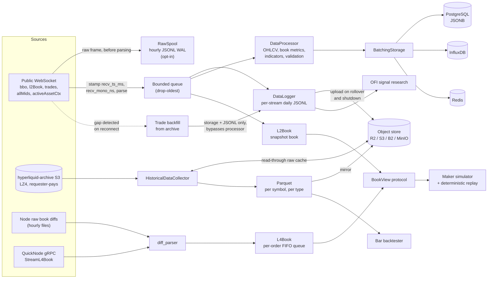

# hyperliquid-data-pipeline

[](https://github.com/Giri-Aayush/hyperliquid-data-pipeline/actions/workflows/tests.yml)

Getting clean Hyperliquid market data is harder than it should be: the public WebSocket sends full L2 snapshots rather than deltas, disconnects leave silent holes in the stream, timestamps arrive without any record of when you received them, and the historical archive is a requester-pays S3 bucket of LZ4 files in a wrapper format the docs only partially describe. This pipeline ingests both sources into one system: every event carries the exchange timestamp and a local receive stamp taken before parsing, raw frames can be spooled losslessly, order books are reconstructed down to per-order FIFO queue position, and the output lands as JSONL, Parquet, and optional database rows ready for research.

It is a data and research system, not a trading system. Nothing in this repository signs, places, or cancels an order.

## Quickstart

No keys and no databases required. This connects to the public WebSocket and prints live BTC data for 30 seconds:

```bash
git clone https://github.com/Giri-Aayush/hyperliquid-data-pipeline.git && cd hyperliquid-data-pipeline
python3 -m venv .venv && .venv/bin/pip install -r requirements.txt
.venv/bin/python scripts/run_pipeline.py test-realtime --symbols BTC --duration 30
```

To persist a research capture instead (all streams to JSONL with dual timestamps):

```bash
.venv/bin/python scripts/capture.py --symbols BTC,ETH,SOL --duration 3600 --output data/research_capture
```

## Architecture

Four ingestion paths feed a shared book core and a set of sinks. The live WebSocket path is built so that a slow consumer can never stall the socket: the read loop stamps, spools, parses, and enqueues; a separate task runs the callbacks.



Component map:

| Path | Module | Role |
|---|---|---|
| Live feed | `collectors/realtime_collector.py` | WebSocket client for bbo, l2Book, trades, allMids, activeAssetCtx, and user events (when a wallet address is configured). Full-jitter exponential reconnect backoff (base 5 s, cap 60 s). Per-channel feed-latency histograms. |
| Lossless capture | `collectors/spool.py` | Every raw frame appended to hourly JSONL before parsing, independent of the drop-oldest queue, so load shedding cannot punch holes in the archive. Off by default (`SPOOL_ENABLED=true`). |
| Gap repair | `collectors/backfill.py` | On reconnect, gaps over 5 s (configurable) trigger an attempted trade backfill from the S3 archive. Recovered points go straight to storage and JSONL, bypassing the processor. In practice the archive publishes no trades (see Limitations), so this path recovers nothing from that source today. |
| History | `collectors/historical_collector.py` | Pulls `market_data/<date>/<hour>/l2Book/<coin>.lz4` and `asset_ctxs/<date>.csv.lz4` from the requester-pays archive, unwraps the on-disk record format, and writes Parquet. A `trades` location is implemented, but the bucket's `market_data` prefix contains only `l2Book` hours. |
| Book core | `book/` | `L4Book` (order-level, from node diffs, with `queue_position`), `L2Book` (snapshot book), one frozen `BookView` read protocol over both, a strict-mode diff parser, and a deterministic replay CLI that reports a checksum. |
| Node feeds | `collectors/node_feed.py`, `collectors/quicknode_feed.py` | Drive `L4Book`s from node `--write-raw-book-diffs` files (offline replay or live tail) or from QuickNode's `StreamL4Book` gRPC stream (`protos/orderbook.proto`). |
| Processing | `processors/data_processor.py` | Trades to OHLCV with VWAP, book metrics through `BookView`, technical indicators, asset-context join. |
| Validation | `utils/validation.py` | Crossed books, bad sort order, price jumps, volume spikes, stale and duplicate points. |
| Storage | `storage/database.py`, `storage/object_store.py` | PostgreSQL, InfluxDB, Redis (each optional; unreachable backends are skipped with a warning), wrapped in a batching writer. S3-compatible object store as raw cache and output mirror. |
| Scheduling | `scheduler/orchestrator.py` | APScheduler jobs: daily history pull at 01:00 UTC, quality report every 6 hours, stats every 30 minutes. Clean shutdown on signals. |
| Research | `research/ofi.py` | Cont, Kukanov and Stoikov best-level order-flow imbalance over captured bbo or archive hours, with windowed forward-return regression, Newey-West t-statistics, and decile tables. |
| Simulation | `sim/` | Event-driven maker simulator: virtual orders in a merged FIFO queue over replayed books, three L2 cancel bounds (pessimistic, pro-rata, optimistic) plus an exact L4 mode, configurable submit latency (default 400 ms), 1.5 bps maker fee, hourly funding accrual, PnL decomposition (spread capture, post-fill drift, fees, funding, mark residual), and a parameter sweep with a pass/fail gate. |
| Backtesting | `backtest/` | Vectorized bar engine with no lookahead (signals shifted one bar), per-side fee and slippage in bps, long/short/flat via a target position in [-1, 1]. |
| Latency bench | `bench/ws_latency.py` | Exact per-channel latency percentiles with an SNTP clock-offset estimate; the same command re-runs unchanged from another host for comparison. |

## Data outputs

### Live JSONL

`DataLogger` writes one file per symbol, stream, and UTC day: `data/realtime/{SYMBOL}_{data_type}_{YYYYMMDD}.jsonl`. Each line is a serialized `MarketDataPoint`:

```json
{"timestamp": "<ISO 8601>", "symbol": "BTC", "data_type": "...", "data": {...}, "recv_ts_ms": 1718300000123.4, "recv_mono_ns": 123456789}
```

`timestamp` is exchange time where the feed provides one (bbo, l2Book, trades) and local time otherwise (allMids, activeAssetCtx). `recv_ts_ms` and `recv_mono_ns` are stamped at the socket read, before parsing. The `data` payload per stream:

| `data_type` | Fields |
|---|---|
| `bbo` | `bid`, `ask` (raw level dicts `{px, sz, n}` with exact string prices, either side may be null), `timestamp_ms` |
| `orderbook` | `bids`, `asks` (lists of raw level dicts), `timestamp_ms` |
| `trade` | `price`, `size`, `side`, `timestamp_ms`, `trade_id` |
| `ticker` | `mid_price`, `timestamp_ms` (local clock) |
| `asset_ctx` | `mark_price`, `oracle_price`, `mid_price`, `open_interest`, `funding`, `premium`, `basis`, `basis_bps`, `timestamp_ms` (local clock) |

### Raw spool

With `SPOOL_ENABLED=true`, every raw WebSocket frame lands in hourly files under `data/spool/`, one line per frame: `{"recv_ts_ms": ..., "recv_mono_ns": ..., "raw": <frame>}`, where the frame is embedded verbatim as a raw JSON value, not re-quoted. This stores the wire bytes, not the parsed interpretation, so it survives parser bugs.

### Historical Parquet

`collect-historical` writes `<output_dir>/<symbol>/<data_type>.parquet`, indexed by a millisecond-resolution `timestamp`:

- `trades.parquet`: `symbol`, `price` (float), `size` (float), `side`, `trade_id`
- `l2Book.parquet`: `symbol`, `bids`, `asks` (raw level lists)

Raw LZ4 pulls are cached in the object store under `raw/<bucket>/<key>` (pay AWS once, re-read from your own bucket), and Parquet output is mirrored under `processed/`.

### Database rows

All configured backends receive the same points. PostgreSQL uses a single `market_data` table: `id`, `timestamp` (timestamptz), `symbol`, `data_type`, `data` (JSONB, lossless), `created_at`, with a composite index on `(symbol, data_type, timestamp)`. Writes go through `BatchingStorage` (default batch 500, flush every 1 s).

## Metrics computed

- OHLCV per timeframe from the live trade buffer or bulk history: `open`, `high`, `low`, `close`, `volume`, `count`, `vwap`. The live path stores 1-minute candles; bulk historical processing generates 1m, 5m, 15m, and 1h.
- Order book, computed per l2Book snapshot through `BookView`: `best_bid`, `best_ask`, `mid_price`, `spread`, `spread_bps`, `total_bid_volume`, `total_ask_volume`, `bid_depth_5`, `ask_depth_5`, `imbalance` (all levels), `imbalance_5` (top 5, the harder-to-spoof variant), `crossed`, `bid_levels`, `ask_levels`.
- Technical indicators over the in-memory close history (200 periods): SMA and EMA at 10/20/50, RSI(14), Bollinger bands (20, 2 sigma) with band width, price change, and a 10-period volume SMA with volume ratio.
- Feed latency: exchange event time minus local receive time, recorded per channel (bbo, l2Book, trades) into log-spaced histograms from 1 ms to 10 s, exposed via `get_stats()["latency_ms"]` in a Prometheus-shaped layout. `scripts/bench_ws_latency.py` reports exact percentiles with an SNTP clock-offset correction.
- Order-flow imbalance (`research/ofi.py`): per-event best-level OFI summed into non-overlapping windows, regressed against forward mid changes per (window, horizon), with Newey-West t-statistics and decile tables. Reads capture JSONL and archive l2Book hours directly.
- Maker simulation (`sim/report.py`): per-run PnL decomposed into spread capture, post-fill drift (adverse selection), fees, funding, and mark residual, per coin, queue bound, and latency.

## Command reference

```bash
# Live smoke test (no persistence)
python scripts/run_pipeline.py test-realtime --symbols BTC --duration 30

# Research capture: all streams to JSONL with dual timestamps
python scripts/capture.py --symbols BTC,ETH,SOL --duration 3600 --output data/research_capture

# Historical pull from S3 (requires AWS credentials; requester-pays, costs money)
python scripts/run_pipeline.py collect-historical --symbols BTC,ETH --start-date 2024-01-01 --end-date 2024-01-07

# Full pipeline: live collection + scheduled history + configured databases
python scripts/run_pipeline.py start

# Feed-latency benchmark
python scripts/bench_ws_latency.py

# Deterministic book replay from recorded node data
PYTHONPATH=src python -m hyperliquid_pipeline.book.replay <snapshot.json> <diff files...>

# OFI research read over captured or archive data
PYTHONPATH=src python -m hyperliquid_pipeline.research.ofi data/research_capture/*_bbo_*.jsonl --windows 1,5 --horizons 1,5,30

# Maker-policy parameter sweep and gate
PYTHONPATH=src python -m hyperliquid_pipeline.sim.sweep data/daily_captures --coins BTC,ETH,SOL
```

The `scripts/` entrypoints put `src/` on the path themselves. The `python -m` module commands need `PYTHONPATH=src` because `requirements.txt` installs dependencies only, not the package.

Configuration is pydantic-settings over `.env` (see `.env.example`). Everything beyond the public WebSocket is optional: AWS keys enable the archive pull, `OBJECT_STORE_*` enables the R2/S3 cache and mirror, and each database is used only if configured and reachable.

## Limitations

- Hyperliquid only, by design. The collectors, archive layout, and book parsers are written against this one venue, and the code is exercised against perpetual symbols (BTC, ETH, SOL by default). No spot-specific handling, no other exchanges.
- No execution layer. Nothing signs or submits an order. The wallet address setting only subscribes to the `user` event stream; the private-key setting is read by config and used nowhere.
- The public l2Book feed is snapshots, not deltas, so book metrics are per-snapshot and there is no queue position from the public feed alone. Per-order state requires node `--write-raw-book-diffs` output or the QuickNode gRPC stream.
- Gap backfill is currently inoperative against the public archive. It targets trades, but the archive's `market_data` prefix contains only `l2Book` hours (verified against the live bucket; see the note in `historical_collector.py`), so reconnect gaps in the trade stream are not recoverable from that source. The order book heals from the next snapshot; missed allMids and asset-context messages are simply gone.
- The live processing queue is drop-oldest under sustained load (drops are counted in `get_stats()`), so the processed stream can shed points during bursts. The lossless spool covers raw frames but is off by default.
- allMids and activeAssetCtx carry no exchange timestamp, so they are stamped with the local clock and excluded from feed-latency measurement. All latency numbers include local clock offset; the bench estimates it with a single SNTP probe and reports both raw and adjusted values.
- Live OHLCV and indicator state is in memory: a 1-hour trade retention window and 200 periods of close history, reset on restart. The stored candle cadence on the live path is 1 minute.
- The bar backtester is vectorized close-to-close with per-side costs. It has no partial fills, no queue modeling, and no funding. The maker simulator covers those, but it runs a single submit delay per sweep, keeps funding accrual off in the sweep gate, and its L2 queue model brackets reality with three cancel-assumption bounds rather than observing real queue position (exact mode requires L4 data).
- The block-envelope wrapper format for node files is only partially verified publicly; unverified assumptions in `book/diff_parser.py` are tagged `VERIFY-ON-REAL-DATA` and the strict parsing mode exists to pin them against real node output.
- The historical collector handles `l2Book`, `trades`, `asset_ctxs`, and `node_fills` locations; there is no candle download. Archive pulls are requester-pays, so history costs real money on your AWS bill.
- Telegram and Prometheus settings exist in `.env.example` but no alerting or exporter code uses them yet; the latency histogram layout is merely exporter-ready.

## Tests

```bash
.venv/bin/python -m pytest tests/ -v
```

370 test functions across the collectors, book core, simulator, backtester, and processors, run in CI on Python 3.11 and 3.12. Nothing in the suite touches the network; WebSocket parsing is tested against recorded Hyperliquid payloads and book reconstruction against fixture files.

## License

MIT. Research tooling, not trading advice.
